# 🤖 Python Machine Learning Study Guide

<div align="center">

[](https://python.org)
[](https://numpy.org)
[](https://pytorch.org)
[](https://scikit-learn.org)
[](LICENSE)

**A comprehensive, hands-on curriculum for mastering Machine Learning with Python**

*From mathematical foundations to production deployment*

[Getting Started](#-getting-started) •
[Learning Path](#-learning-path) •
[Architecture](#-system-architecture) •
[Technologies](#-technology-stack)

</div>

---

## 📖 Table of Contents

- [Why This Project?](#-why-this-project)
- [Project Goals](#-project-goals)
- [System Architecture](#-system-architecture)
- [Learning Path](#-learning-path)
- [Technology Stack](#-technology-stack)
- [Project Timeline](#-project-timeline)
- [Getting Started](#-getting-started)
- [Project Structure](#-project-structure)
- [Current Progress](#-current-progress)

---

## 🎯 Why This Project?

### The Problem

Learning Machine Learning is challenging due to:

| <sub>Challenge</sub> | <sub>Impact</sub> | <sub>Our Solution</sub> |
| ------------------------ | ------------------------------------------------ | ---------------------------------------- |
| <sub>**Fragmented Resources**</sub> | <sub>Learners jump between tutorials without cohesion</sub> | <sub>Unified, progressive curriculum</sub> |
| <sub>**Theory-Practice Gap**</sub> | <sub>Math concepts don't connect to code</sub> | <sub>Every concept has implementation</sub> |
| <sub>**No Production Focus**</sub> | <sub>Tutorials don't cover real-world deployment</sub> | <sub>End-to-end projects with deployment</sub> |
| <sub>**Outdated Content**</sub> | <sub>Many resources use deprecated libraries</sub> | <sub>Modern stack (PyTorch 2.0+, Python 3.12)</sub> |
| <sub>**Missing Testing**</sub> | <sub>No emphasis on code quality</sub> | <sub>TDD approach with pytest</sub> |

### The Solution

This study guide provides a **structured, progressive path** from Python basics to deploying production ML systems:

```mermaid
flowchart LR
    subgraph Foundation["🔧 Foundation"]
        A[NumPy]
        B[Pandas]
        C[Visualization]
    end

    subgraph Classical["📊 Classical ML"]
        D[Supervised]
        E[Unsupervised]
    end

    subgraph Deep["🧠 Deep Learning"]
        F[Neural Nets]
        G[CNNs]
        H[RNNs]
    end

    subgraph Applied["🚀 Applied"]
        I[NLP]
        J[Computer Vision]
        K[Projects]
    end

    Foundation --> Classical
    Classical --> Deep
    Deep --> Applied

    style Foundation fill:#1a1a2e,stroke:#00d4ff,color:#fff
    style Classical fill:#1a1a2e,stroke:#00ff88,color:#fff
    style Deep fill:#1a1a2e,stroke:#ff6b6b,color:#fff
    style Applied fill:#1a1a2e,stroke:#ffd93d,color:#fff
```

---

## 🎓 Project Goals

### Learning Objectives

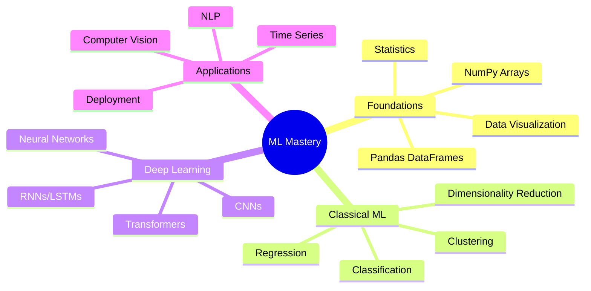

### Success Metrics

| <sub>Metric</sub> | <sub>Target</sub> | <sub>Measurement</sub> |
| ----------------------- | ---------------- | ----------------------------- |
| <sub>**Notebooks Completed**</sub> | <sub>50+</sub> | <sub>Interactive Jupyter notebooks</sub> |
| <sub>**Unit Tests**</sub> | <sub>90%+ coverage</sub> | <sub>pytest with coverage reports</sub> |
| <sub>**Projects Built**</sub> | <sub>5+ end-to-end</sub> | <sub>From data to deployment</sub> |
| <sub>**Code Quality**</sub> | <sub>100% type-hinted</sub> | <sub>mypy + pylint passing</sub> |

---

## 🏗️ System Architecture

### High-Level Overview

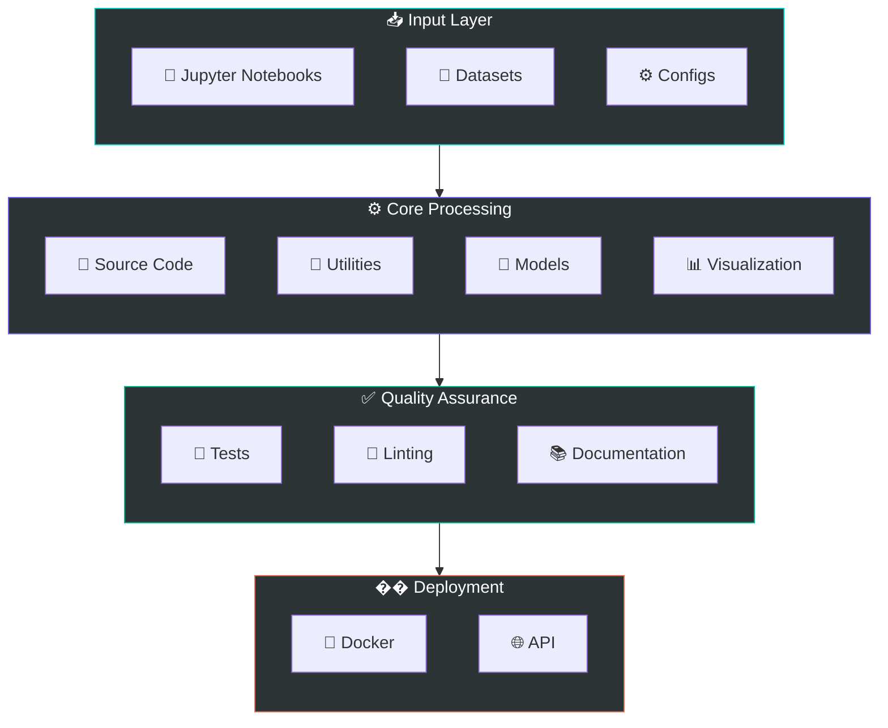

### Directory Architecture

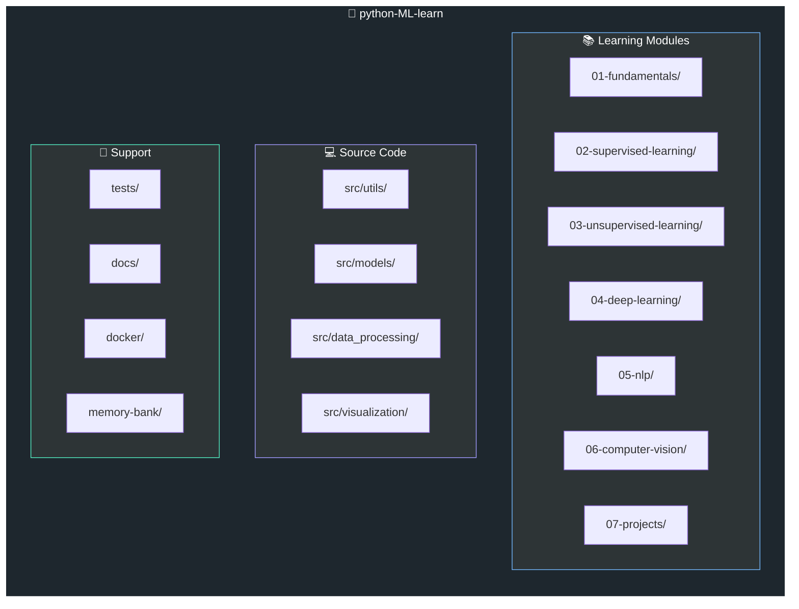

### Data Flow Architecture

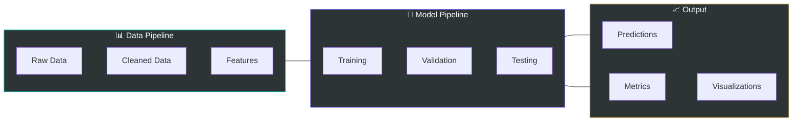

---

## 📚 Learning Path

### Phase Overview

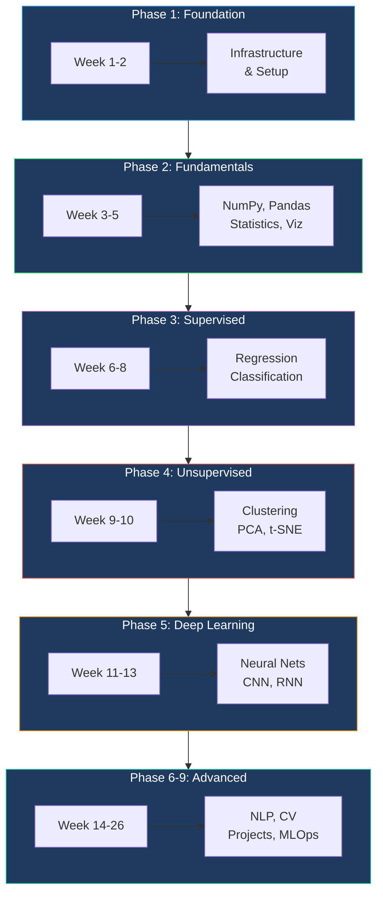

### Curriculum Details

<details>
<summary><b>📘 Phase 1: Foundation (Weeks 1-2)</b></summary>

| <sub>Topic</sub> | <sub>Description</sub> | <sub>Deliverable</sub> |
| ----------------------- | ------------------------ | ---------------------------------- |
| <sub>Project Structure</sub> | <sub>Modular src layout</sub> | <sub>Folder hierarchy</sub> |
| <sub>Development Environment</sub> | <sub>VS Code + extensions</sub> | <sub>`.vscode/settings.json`</sub> |
| <sub>Docker Setup</sub> | <sub>Reproducible environment</sub> | <sub>`Dockerfile`, `docker-compose.yml`</sub> |
| <sub>Testing Framework</sub> | <sub>pytest configuration</sub> | <sub>`conftest.py`, `pytest.ini`</sub> |

**Status**: ✅ Complete

</details>

<details>
<summary><b>📗 Phase 2: Core ML Fundamentals (Weeks 3-5)</b></summary>

| <sub>Topic</sub> | <sub>Key Concepts</sub> | <sub>Notebook</sub> |
| ---------------------- | ------------------------------------ | ----------------------------------- |
| <sub>**NumPy**</sub> | <sub>Arrays, broadcasting, linear algebra</sub> | <sub>`01_numpy_fundamentals.ipynb`</sub> |
| <sub>**Pandas**</sub> | <sub>DataFrames, cleaning, aggregation</sub> | <sub>`02_pandas_data_manipulation.ipynb`</sub> |
| <sub>**Visualization**</sub> | <sub>matplotlib, seaborn, plotly</sub> | <sub>`03_data_visualization.ipynb`</sub> |
| <sub>**Statistics**</sub> | <sub>Distributions, hypothesis testing</sub> | <sub>`04_statistics_for_ml.ipynb`</sub> |
| <sub>**Scikit-learn Intro**</sub> | <sub>Pipelines, preprocessing, models</sub> | <sub>`05_sklearn_introduction.ipynb`</sub> |

**Status**: ✅ Complete (5 notebooks, 114 tests)

</details>

<details>
<summary><b>📙 Phase 3: Supervised Learning (Weeks 6-8)</b></summary>

| <sub>Algorithm</sub> | <sub>Mathematical Foundation</sub> | <sub>Implementation</sub> |
| ----------------------- | --------------------------------- | ---------------------- |
| <sub>**Linear Regression**</sub> | <sub>$\hat{y} = X\beta$, MSE loss</sub> | <sub>From scratch + sklearn</sub> |
| <sub>**Logistic Regression**</sub> | <sub>Sigmoid, cross-entropy</sub> | <sub>Binary & multiclass</sub> |
| <sub>**Decision Trees**</sub> | <sub>Gini impurity, entropy</sub> | <sub>Visualization included</sub> |
| <sub>**Random Forests**</sub> | <sub>Bagging, feature importance</sub> | <sub>Hyperparameter tuning</sub> |
| <sub>**SVM**</sub> | <sub>Kernel trick, margin maximization</sub> | <sub>Multiple kernels</sub> |
| <sub>**Gradient Boosting**</sub> | <sub>Sequential ensembles</sub> | <sub>XGBoost, LightGBM</sub> |

**Status**: ✅ Complete (5 notebooks, 15 tests)

</details>

<details>
<summary><b>📕 Phase 4: Unsupervised Learning (Weeks 9-10)</b></summary>

| <sub>Algorithm</sub> | <sub>Purpose</sub> | <sub>Implementation</sub> |
| --------------------- | ------------------------- | ------------------------------------ |
| <sub>**K-Means**</sub> | <sub>Centroid-based clustering</sub> | <sub>From scratch + sklearn</sub> |
| <sub>**Hierarchical**</sub> | <sub>Agglomerative clustering</sub> | <sub>Dendrograms</sub> |
| <sub>**DBSCAN**</sub> | <sub>Density-based clustering</sub> | <sub>Parameter tuning</sub> |
| <sub>**PCA**</sub> | <sub>Dimensionality reduction</sub> | <sub>From scratch + sklearn</sub> |
| <sub>**t-SNE**</sub> | <sub>Visualization</sub> | <sub>Perplexity tuning</sub> |
| <sub>**Anomaly Detection**</sub> | <sub>Outlier detection</sub> | <sub>Isolation Forest, LOF, One-Class SVM</sub> |

**Status**: ✅ Complete (3 notebooks, 37 tests)

</details>

<details>
<summary><b>📕 Phase 5-9: Advanced Topics (Weeks 11-26)</b></summary>

| <sub>Phase</sub> | <sub>Topics</sub> | <sub>Hours</sub> |
| ---------------------- | ------------------------------ | ----- |
| <sub>**5. Deep Learning**</sub> | <sub>Neural nets, CNN, RNN, PyTorch</sub> | <sub>90</sub> |
| <sub>**6. NLP**</sub> | <sub>Embeddings, BERT, Transformers</sub> | <sub>70</sub> |
| <sub>**7. Computer Vision**</sub> | <sub>Object detection, segmentation</sub> | <sub>70</sub> |
| <sub>**8. Projects**</sub> | <sub>End-to-end ML systems</sub> | <sub>100+</sub> |
| <sub>**9. MLOps**</sub> | <sub>Deployment, monitoring, CI/CD</sub> | <sub>40</sub> |

</details>

---

## 🛠️ Technology Stack

### Core Technologies Explained

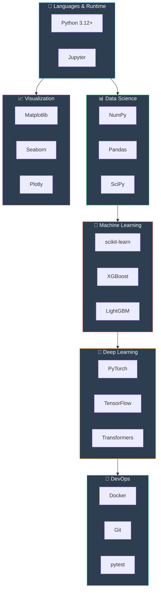

### Technology Reference

| <sub>Technology</sub> | <sub>Version</sub> | <sub>Purpose</sub> | <sub>Why Chosen</sub> |
| ---------------- | ------- | ------------------- | ---------------------------------------------- |
| <sub>**Python**</sub> | <sub>3.12+</sub> | <sub>Core language</sub> | <sub>Industry standard, rich ecosystem</sub> |
| <sub>**NumPy**</sub> | <sub>2.4+</sub> | <sub>Numerical computing</sub> | <sub>10-100x faster than pure Python, vectorization</sub> |
| <sub>**Pandas**</sub> | <sub>2.0+</sub> | <sub>Data manipulation</sub> | <sub>Intuitive DataFrame API, SQL-like operations</sub> |
| <sub>**scikit-learn**</sub> | <sub>1.3+</sub> | <sub>Classical ML</sub> | <sub>Consistent API, comprehensive algorithms</sub> |
| <sub>**PyTorch**</sub> | <sub>2.0+</sub> | <sub>Deep learning</sub> | <sub>Dynamic graphs, Pythonic, research-friendly</sub> |
| <sub>**TensorFlow**</sub> | <sub>2.13+</sub> | <sub>Deep learning</sub> | <sub>Production-ready, TensorBoard, Keras API</sub> |
| <sub>**Matplotlib**</sub> | <sub>3.7+</sub> | <sub>Plotting</sub> | <sub>Highly customizable, publication quality</sub> |
| <sub>**Seaborn**</sub> | <sub>0.12+</sub> | <sub>Statistical viz</sub> | <sub>Beautiful defaults, statistical plots</sub> |
| <sub>**Docker**</sub> | <sub>Latest</sub> | <sub>Containerization</sub> | <sub>Reproducible environments</sub> |
| <sub>**pytest**</sub> | <sub>7.4+</sub> | <sub>Testing</sub> | <sub>Simple syntax, powerful fixtures</sub> |

### NumPy: The Foundation

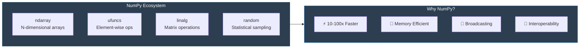

**Definition**: NumPy is the fundamental package for scientific computing in Python.

**Motivation**: Python lists are slow for numerical operations. NumPy provides:
- Contiguous memory allocation
- Vectorized operations (no Python loops)
- C-level execution speed

**Mechanism**:
```python
# Python list (slow)
result = [x ** 2 for x in range(1000000)]  # ~200ms

# NumPy array (fast)
arr = np.arange(1000000)
result = arr ** 2  # ~2ms (100x faster!)
```

**Impact**: Enables processing of large datasets that would be impractical with pure Python.

---

## 📅 Project Timeline

### Gantt Chart

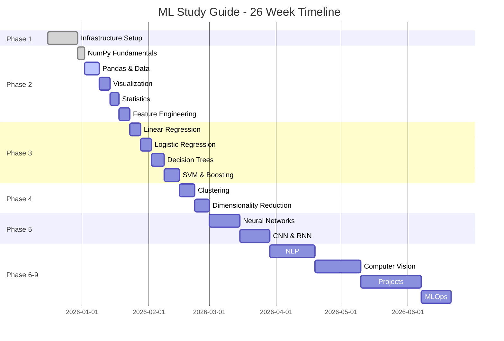

### Milestone Tracker

| <sub>Milestone</sub> | <sub>Target</sub> | <sub>Status</sub> | <sub>Progress</sub> |
| ------------------- | ------- | ------------- | ----------------- |
| <sub>M1: Infrastructure</sub> | <sub>Week 2</sub> | <sub>✅ Complete</sub> | <sub>████████████ 100%</sub> |
| <sub>M2: Fundamentals</sub> | <sub>Week 5</sub> | <sub>✅ Complete</sub> | <sub>████████████ 100%</sub> |
| <sub>M3: Supervised</sub> | <sub>Week 8</sub> | <sub>✅ Complete</sub> | <sub>████████████ 100%</sub> |
| <sub>M4: Unsupervised</sub> | <sub>Week 10</sub> | <sub>✅ Complete</sub> | <sub>████████████ 100%</sub> |
| <sub>M5: Deep Learning</sub> | <sub>Week 13</sub> | <sub>✅ Complete</sub> | <sub>████████████ 100%</sub> |
| <sub>M6: NLP</sub> | <sub>Week 16</sub> | <sub>✅ Complete</sub> | <sub>████████████ 100%</sub> |
| <sub>M7: Computer Vision</sub> | <sub>Week 19</sub> | <sub>✅ Complete</sub> | <sub>████████████ 100%</sub> |
| <sub>M8: Projects</sub> | <sub>Week 24</sub> | <sub>✅ Complete</sub> | <sub>████████████ 100%</sub> |
| <sub>M9: MLOps</sub> | <sub>Week 26</sub> | <sub>⭕ Not Started</sub> | <sub>░░░░░░░░░░░░ 0%</sub> |

---

## 🚀 Getting Started

### Prerequisites

| <sub>Requirement</sub> | <sub>Version</sub> | <sub>Check Command</sub> |
| ----------------- | ------- | ------------------ |
| <sub>Python</sub> | <sub>3.8+</sub> | <sub>`python --version`</sub> |
| <sub>pip</sub> | <sub>Latest</sub> | <sub>`pip --version`</sub> |
| <sub>Git</sub> | <sub>Latest</sub> | <sub>`git --version`</sub> |
| <sub>Docker (optional)</sub> | <sub>Latest</sub> | <sub>`docker --version`</sub> |

### Quick Start

```bash
# 1. Clone the repository
git clone https://github.com/yourusername/python-ML-learn.git
cd python-ML-learn

# 2. Create virtual environment
python -m venv venv
source venv/bin/activate  # Windows: venv\Scripts\activate

# 3. Install dependencies
pip install -r requirements.txt

# 4. Start Jupyter Lab
jupyter lab
```

### Docker Setup (Recommended)

```bash
# Build and run with Docker Compose
cd docker
docker-compose up -d

# Access Jupyter Lab at http://localhost:8888
```

### Verify Installation

```bash
# Run tests to verify setup
python -m pytest tests/ -v

# Expected output: All tests passing
```

---

## 📁 Project Structure

```
python-ML-learn/
├── 📓 01-fundamentals/          # NumPy, Pandas, Visualization (5 notebooks)
│   ├── 01_numpy_fundamentals.ipynb
│   ├── 02_pandas_data_manipulation.ipynb
│   ├── 03_data_visualization.ipynb
│   ├── 04_statistics_for_ml.ipynb
│   └── 05_sklearn_introduction.ipynb
├── 📓 02-supervised-learning/   # Regression, Classification (5 notebooks)
│   ├── 01_linear_regression.ipynb
│   ├── 02_logistic_regression.ipynb
│   ├── 03_decision_trees_random_forests.ipynb
│   ├── 04_svm.ipynb
│   └── 05_gradient_boosting.ipynb
├── 📓 03-unsupervised-learning/ # Clustering, PCA (3 notebooks)
│   ├── 01_clustering.ipynb
│   ├── 02_dimensionality_reduction.ipynb
│   └── 03_anomaly_detection.ipynb
├── 📓 04-deep-learning/         # Neural Networks, CNN, RNN (5 notebooks)
│   ├── 01_neural_network_fundamentals.ipynb
│   ├── 02_pytorch_introduction.ipynb
│   ├── 03_convolutional_neural_networks.ipynb
│   ├── 04_recurrent_neural_networks.ipynb
│   └── 05_training_techniques.ipynb
├── 📓 05-nlp/                   # Text Processing, Transformers (5 notebooks)
│   ├── 01_text_preprocessing.ipynb
│   ├── 02_text_vectorization.ipynb
│   ├── 03_word_embeddings.ipynb
│   ├── 04_text_classification.ipynb
│   └── 05_transformers_introduction.ipynb
├── 📓 06-computer-vision/       # Object Detection, Segmentation (5 notebooks)
│   ├── 01_image_fundamentals.ipynb
│   ├── 02_cnn_architectures.ipynb
│   ├── 03_transfer_learning.ipynb
│   ├── 04_object_detection.ipynb
│   └── 05_image_segmentation.ipynb
├── 📓 07-projects/              # End-to-End Projects (5 notebooks)
│   ├── 01_house_price_prediction.ipynb
│   ├── 02_customer_churn_prediction.ipynb
│   ├── 03_image_classification_app.ipynb
│   ├── 04_sentiment_analysis_pipeline.ipynb
│   └── 05_recommendation_system.ipynb
├── 📓 08-mlops/                 # MLOps & Production (5 notebooks)
│   ├── 01_model_serving_fastapi.ipynb
│   ├── 02_docker_containerization.ipynb
│   ├── 03_experiment_tracking.ipynb
│   ├── 04_cicd_pipelines.ipynb
│   └── 05_model_monitoring.ipynb
│
├── 💻 src/                      # Source Code
│   ├── utils/                   # Utility functions
│   │   ├── timer.py            # Performance timing
│   │   ├── numpy_helpers.py    # NumPy utilities
│   │   ├── pandas_helpers.py   # Pandas utilities
│   │   ├── stats_helpers.py    # Statistical functions
│   │   ├── sklearn_helpers.py  # Scikit-learn utilities
│   │   └── visualization_helpers.py # Plotting utilities
│   ├── ml_core/                 # ML helper modules
│   │   ├── supervised.py       # Supervised learning helpers
│   │   ├── unsupervised.py     # Unsupervised learning helpers
│   │   ├── deep_learning.py    # Deep learning helpers
│   │   ├── nlp.py              # NLP helpers
│   │   └── computer_vision.py  # Computer vision helpers
│   ├── models/                  # ML model implementations
│   ├── data_processing/         # Data pipelines
│   └── visualization/           # Plotting utilities
│
├── 🧪 tests/                    # Test Suite
│   ├── unit/                    # Unit tests
│   └── integration/             # Integration tests
│
├── 📚 docs/                     # Documentation
│   └── project-plan.md         # Detailed project plan
│
├── 🗃️ memory-bank/              # Project Memory
│   ├── change-log.md           # Version history
│   └── architecture-decisions/ # ADRs
│
├── 🐳 docker/                   # Docker Configuration
│   ├── Dockerfile
│   └── docker-compose.yml
│
├── 📊 data/                     # Datasets
│   ├── raw/                    # Original data
│   └── processed/              # Cleaned data
│
├── ⚙️ configs/                   # Configuration files
├── 📜 requirements.txt          # Python dependencies
└── 📖 README.md                 # This file
```

---

## 📊 Current Progress

### 🎉 Project Complete!

All 9 phases of the Machine Learning curriculum have been completed!

### Phase Completion

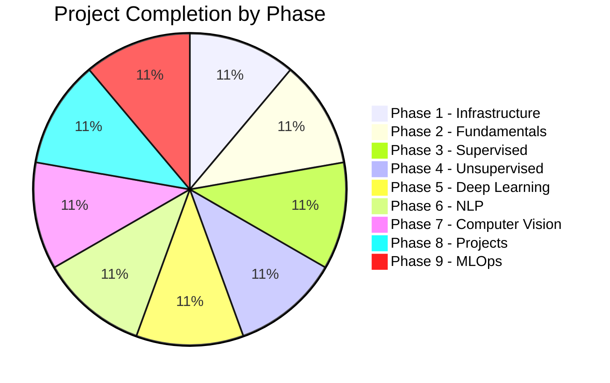

### Test Coverage

| <sub>Module</sub> | <sub>Tests</sub> | <sub>Coverage</sub> | <sub>Status</sub> |
| -------------------------------- | ----- | -------- | ------ |
| <sub>`utils/timer.py`</sub> | <sub>14</sub> | <sub>95%</sub> | <sub>✅</sub> |
| <sub>`utils/numpy_helpers.py`</sub> | <sub>24</sub> | <sub>100%</sub> | <sub>✅</sub> |
| <sub>`utils/pandas_helpers.py`</sub> | <sub>21</sub> | <sub>100%</sub> | <sub>✅</sub> |
| <sub>`utils/stats_helpers.py`</sub> | <sub>33</sub> | <sub>100%</sub> | <sub>✅</sub> |
| <sub>`utils/sklearn_helpers.py`</sub> | <sub>29</sub> | <sub>100%</sub> | <sub>✅</sub> |
| <sub>`utils/visualization_helpers.py`</sub> | <sub>31</sub> | <sub>100%</sub> | <sub>✅</sub> |
| <sub>`ml_core/supervised.py`</sub> | <sub>15</sub> | <sub>100%</sub> | <sub>✅</sub> |
| <sub>`ml_core/unsupervised.py`</sub> | <sub>37</sub> | <sub>100%</sub> | <sub>✅</sub> |
| <sub>`ml_core/deep_learning.py`</sub> | <sub>42</sub> | <sub>100%</sub> | <sub>✅</sub> |
| <sub>`ml_core/nlp.py`</sub> | <sub>53</sub> | <sub>100%</sub> | <sub>✅</sub> |
| <sub>`ml_core/computer_vision.py`</sub> | <sub>63</sub> | <sub>100%</sub> | <sub>✅</sub> |

**Total Tests**: 362 passing ✅

### Recent Updates

| <sub>Date</sub> | <sub>Version</sub> | <sub>Changes</sub> |
| ---------- | ------- | --------------------------------------------------------------------------- |
| <sub>2025-12-22</sub> | <sub>v2.0.0</sub> | <sub>🎉 Phase 9: MLOps & Production (model serving, Docker, CI/CD, monitoring)</sub> |
| <sub>2025-12-22</sub> | <sub>v1.12.0</sub> | <sub>Phase 8: End-to-End Projects (5 comprehensive ML projects)</sub> |
| <sub>2025-07-09</sub> | <sub>v1.11.0</sub> | <sub>Phase 7: Computer Vision (image fundamentals, CNN, detection, segmentation)</sub> |
| <sub>2025-07-08</sub> | <sub>v1.10.0</sub> | <sub>Phase 6: NLP (text preprocessing, embeddings, transformers)</sub> |
| <sub>2025-07-08</sub> | <sub>v1.9.0</sub> | <sub>Phase 5: Deep learning (PyTorch, CNN, RNN, training techniques)</sub> |
| <sub>2025-07-08</sub> | <sub>v1.8.0</sub> | <sub>Phase 4: Unsupervised learning (clustering, PCA, anomaly detection)</sub> |
| <sub>2025-07-08</sub> | <sub>v1.7.0</sub> | <sub>Phase 3: Supervised learning (regression, classification, SVM, boosting)</sub> |
| <sub>2025-07-08</sub> | <sub>v1.6.0</sub> | <sub>Phase 2: Fundamentals complete (5 notebooks, helper modules)</sub> |
| <sub>2025-07-08</sub> | <sub>v1.0.0</sub> | <sub>Initial project structure, Docker setup</sub> |

---

## 📈 Learning Tips

### Best Practices

1. **📐 Understand the Math**: Don't skip mathematical intuition
2. **💻 Code from Scratch**: Implement algorithms before using libraries
3. **📊 Visualize Everything**: Use plots to understand behavior
4. **�� Read Comments**: Code is heavily documented
5. **🔁 Practice Daily**: Consistency is key
6. **🧪 Write Tests**: Verify your implementations

### Study Schedule

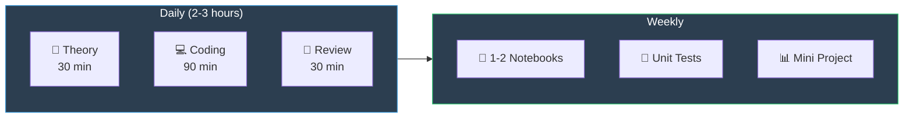

---

## 🔗 Resources

### Documentation

| <sub>Resource</sub> | <sub>Link</sub> | <sub>Description</sub> |
| ------------ | ---------------------------------------------------- | ---------------- |
| <sub>NumPy</sub> | <sub>[numpy.org](https://numpy.org/doc/)</sub> | <sub>Array computing</sub> |
| <sub>Pandas</sub> | <sub>[pandas.pydata.org](https://pandas.pydata.org/docs/)</sub> | <sub>Data analysis</sub> |
| <sub>scikit-learn</sub> | <sub>[scikit-learn.org](https://scikit-learn.org/stable/)</sub> | <sub>Machine learning</sub> |
| <sub>PyTorch</sub> | <sub>[pytorch.org](https://pytorch.org/docs/)</sub> | <sub>Deep learning</sub> |
| <sub>TensorFlow</sub> | <sub>[tensorflow.org](https://www.tensorflow.org/guide)</sub> | <sub>Deep learning</sub> |

### Learning Platforms

- �� [Kaggle Learn](https://www.kaggle.com/learn) - Free micro-courses
- 📊 [Papers With Code](https://paperswithcode.com/) - Research implementations
- 🎥 [3Blue1Brown](https://www.3blue1brown.com/) - Visual math explanations

---

## 🤝 Contributing

Contributions are welcome! Please:

1. Fork the repository
2. Create a feature branch
3. Write tests for new code
4. Submit a pull request

---

## 📄 License

MIT License - Feel free to use for personal learning.

---

<div align="center">

**Made with ❤️ for Machine Learning Enthusiasts**

⭐ Star this repo if you find it helpful!

</div>