# 🤖 Python Machine Learning Study Guide

<div align="center">

[](https://python.org)
[](https://numpy.org)
[](https://pytorch.org)
[](https://scikit-learn.org)
[](LICENSE)

**A comprehensive, hands-on curriculum for mastering Machine Learning with Python**

*From mathematical foundations to production deployment*

[Getting Started](#-getting-started) •
[Learning Path](#-learning-path) •
[Architecture](#-system-architecture) •
[Technologies](#-technology-stack)

</div>

---

## 📖 Table of Contents

- [Why This Project?](#-why-this-project)
- [Project Goals](#-project-goals)
- [System Architecture](#-system-architecture)
- [Learning Path](#-learning-path)
- [Technology Stack](#-technology-stack)
- [Project Timeline](#-project-timeline)
- [Getting Started](#-getting-started)
- [Project Structure](#-project-structure)
- [Current Progress](#-current-progress)

---

## 🎯 Why This Project?

### The Problem

Learning Machine Learning is challenging due to:

| Challenge | Impact | Our Solution |
|-----------|--------|--------------|
| **Fragmented Resources** | Learners jump between tutorials without cohesion | Unified, progressive curriculum |
| **Theory-Practice Gap** | Math concepts don't connect to code | Every concept has implementation |
| **No Production Focus** | Tutorials don't cover real-world deployment | End-to-end projects with deployment |
| **Outdated Content** | Many resources use deprecated libraries | Modern stack (PyTorch 2.0+, Python 3.12) |
| **Missing Testing** | No emphasis on code quality | TDD approach with pytest |

### The Solution

This study guide provides a **structured, progressive path** from Python basics to deploying production ML systems:

```mermaid
flowchart LR
    subgraph Foundation["🔧 Foundation"]
        A[NumPy]
        B[Pandas]
        C[Visualization]
    end

    subgraph Classical["📊 Classical ML"]
        D[Supervised]
        E[Unsupervised]
    end

    subgraph Deep["🧠 Deep Learning"]
        F[Neural Nets]
        G[CNNs]
        H[RNNs]
    end

    subgraph Applied["🚀 Applied"]
        I[NLP]
        J[Computer Vision]
        K[Projects]
    end

    Foundation --> Classical
    Classical --> Deep
    Deep --> Applied

    style Foundation fill:#1a1a2e,stroke:#00d4ff,color:#fff
    style Classical fill:#1a1a2e,stroke:#00ff88,color:#fff
    style Deep fill:#1a1a2e,stroke:#ff6b6b,color:#fff
    style Applied fill:#1a1a2e,stroke:#ffd93d,color:#fff
```

---

## 🎓 Project Goals

### Learning Objectives

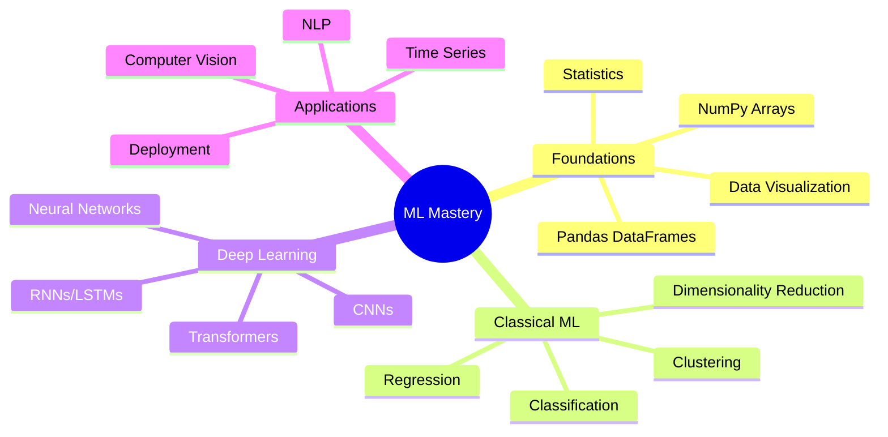

### Success Metrics

| Metric | Target | Measurement |
|--------|--------|-------------|
| **Notebooks Completed** | 50+ | Interactive Jupyter notebooks |
| **Unit Tests** | 90%+ coverage | pytest with coverage reports |
| **Projects Built** | 5+ end-to-end | From data to deployment |
| **Code Quality** | 100% type-hinted | mypy + pylint passing |

---

## 🏗️ System Architecture

### High-Level Overview

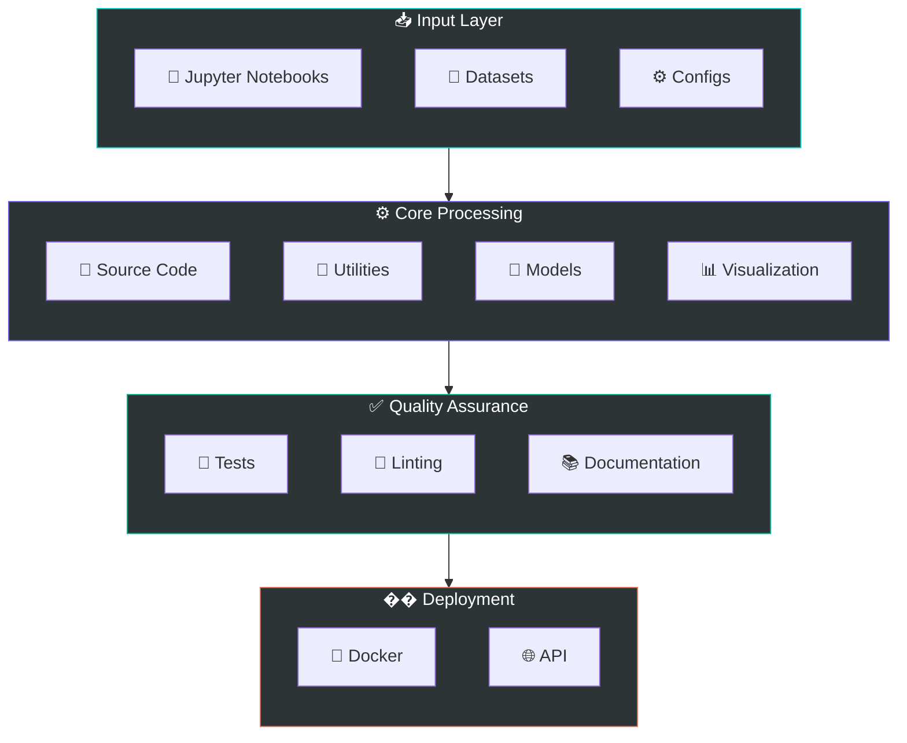

### Directory Architecture

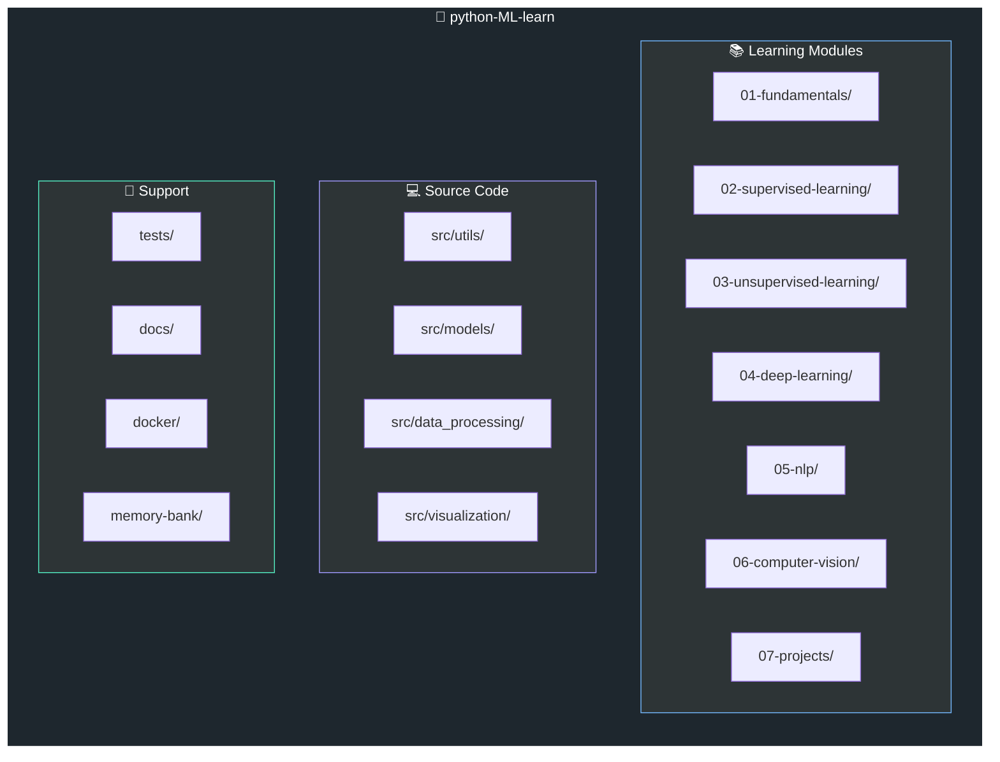

### Data Flow Architecture

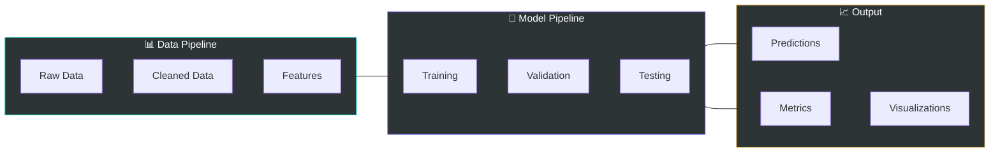

---

## 📚 Learning Path

### Phase Overview

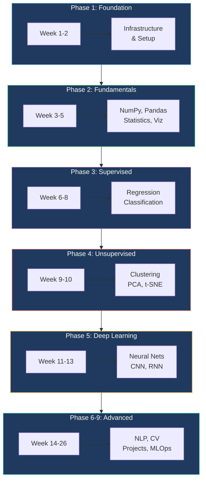

### Curriculum Details

<details>
<summary><b>📘 Phase 1: Foundation (Weeks 1-2)</b></summary>

| Topic | Description | Deliverable |
|-------|-------------|-------------|
| Project Structure | Modular src layout | Folder hierarchy |
| Development Environment | VS Code + extensions | `.vscode/settings.json` |
| Docker Setup | Reproducible environment | `Dockerfile`, `docker-compose.yml` |
| Testing Framework | pytest configuration | `conftest.py`, `pytest.ini` |

**Status**: ✅ Complete

</details>

<details>
<summary><b>📗 Phase 2: Core ML Fundamentals (Weeks 3-5)</b></summary>

| Topic | Key Concepts | Notebook |
|-------|--------------|----------|
| **NumPy** | Arrays, broadcasting, linear algebra | `01_numpy_fundamentals.ipynb` |
| **Pandas** | DataFrames, cleaning, aggregation | `02_pandas_data_manipulation.ipynb` |
| **Visualization** | matplotlib, seaborn, plotly | `03_data_visualization.ipynb` |
| **Statistics** | Distributions, hypothesis testing | `04_statistics_probability.ipynb` |
| **Feature Engineering** | Scaling, encoding, pipelines | `05_feature_engineering.ipynb` |

**Status**: 🟡 In Progress (NumPy complete)

</details>

<details>
<summary><b>📙 Phase 3: Supervised Learning (Weeks 6-8)</b></summary>

| Algorithm | Mathematical Foundation | Implementation |
|-----------|------------------------|----------------|
| **Linear Regression** | $\hat{y} = X\beta$, MSE loss | From scratch + sklearn |
| **Logistic Regression** | Sigmoid, cross-entropy | Binary & multiclass |
| **Decision Trees** | Gini impurity, entropy | Visualization included |
| **Random Forests** | Bagging, feature importance | Hyperparameter tuning |
| **SVM** | Kernel trick, margin maximization | Multiple kernels |
| **Gradient Boosting** | Sequential ensembles | XGBoost, LightGBM |

**Status**: ⭕ Not Started

</details>

<details>
<summary><b>📕 Phase 4-9: Advanced Topics (Weeks 9-26)</b></summary>

| Phase | Topics | Hours |
|-------|--------|-------|
| **4. Unsupervised** | K-Means, DBSCAN, PCA, t-SNE | 50 |
| **5. Deep Learning** | Neural nets, CNN, RNN, PyTorch | 90 |
| **6. NLP** | Embeddings, BERT, Transformers | 70 |
| **7. Computer Vision** | Object detection, segmentation | 70 |
| **8. Projects** | End-to-end ML systems | 100+ |
| **9. MLOps** | Deployment, monitoring, CI/CD | 40 |

</details>

---

## 🛠️ Technology Stack

### Core Technologies Explained

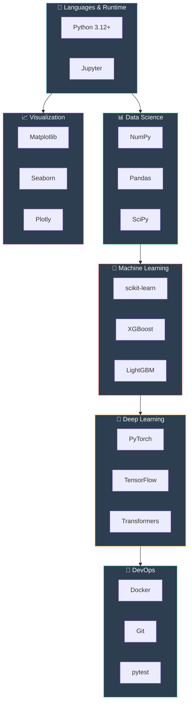

### Technology Reference

| Technology | Version | Purpose | Why Chosen |
|------------|---------|---------|------------|
| **Python** | 3.12+ | Core language | Industry standard, rich ecosystem |
| **NumPy** | 2.4+ | Numerical computing | 10-100x faster than pure Python, vectorization |
| **Pandas** | 2.0+ | Data manipulation | Intuitive DataFrame API, SQL-like operations |
| **scikit-learn** | 1.3+ | Classical ML | Consistent API, comprehensive algorithms |
| **PyTorch** | 2.0+ | Deep learning | Dynamic graphs, Pythonic, research-friendly |
| **TensorFlow** | 2.13+ | Deep learning | Production-ready, TensorBoard, Keras API |
| **Matplotlib** | 3.7+ | Plotting | Highly customizable, publication quality |
| **Seaborn** | 0.12+ | Statistical viz | Beautiful defaults, statistical plots |
| **Docker** | Latest | Containerization | Reproducible environments |
| **pytest** | 7.4+ | Testing | Simple syntax, powerful fixtures |

### NumPy: The Foundation

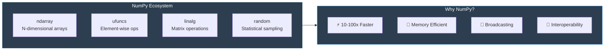

**Definition**: NumPy is the fundamental package for scientific computing in Python.

**Motivation**: Python lists are slow for numerical operations. NumPy provides:
- Contiguous memory allocation
- Vectorized operations (no Python loops)
- C-level execution speed

**Mechanism**:
```python
# Python list (slow)
result = [x ** 2 for x in range(1000000)]  # ~200ms

# NumPy array (fast)
arr = np.arange(1000000)
result = arr ** 2  # ~2ms (100x faster!)
```

**Impact**: Enables processing of large datasets that would be impractical with pure Python.

---

## 📅 Project Timeline

### Gantt Chart

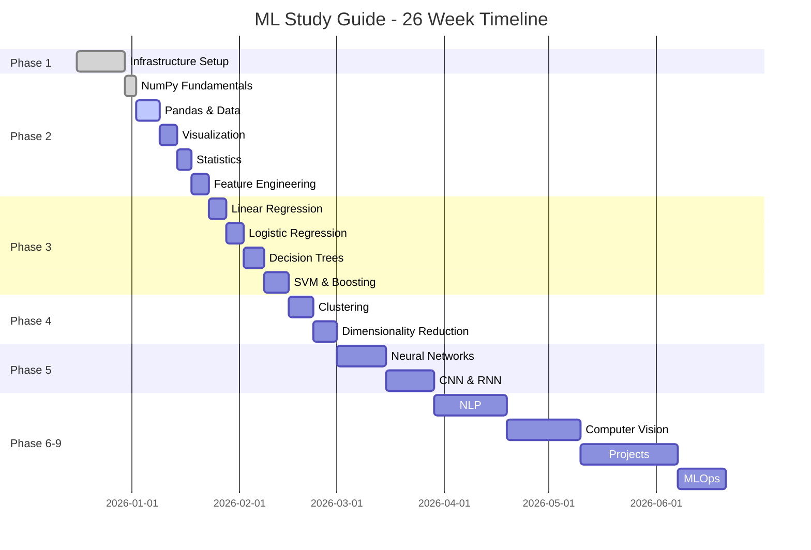

### Milestone Tracker

| Milestone | Target | Status | Progress |
|-----------|--------|--------|----------|
| M1: Infrastructure | Week 2 | ✅ Complete | ████████████ 100% |
| M2: Fundamentals | Week 5 | 🟡 In Progress | ██░░░░░░░░░░ 20% |
| M3: Supervised | Week 8 | ⭕ Not Started | ░░░░░░░░░░░░ 0% |
| M4: Unsupervised | Week 10 | ⭕ Not Started | ░░░░░░░░░░░░ 0% |
| M5: Deep Learning | Week 13 | ⭕ Not Started | ░░░░░░░░░░░░ 0% |
| M6: NLP | Week 16 | ⭕ Not Started | ░░░░░░░░░░░░ 0% |
| M7: Computer Vision | Week 19 | ⭕ Not Started | ░░░░░░░░░░░░ 0% |
| M8: Projects | Week 24 | ⭕ Not Started | ░░░░░░░░░░░░ 0% |
| M9: MLOps | Week 26 | ⭕ Not Started | ░░░░░░░░░░░░ 0% |

---

## 🚀 Getting Started

### Prerequisites

| Requirement | Version | Check Command |
|-------------|---------|---------------|
| Python | 3.8+ | `python --version` |
| pip | Latest | `pip --version` |
| Git | Latest | `git --version` |
| Docker (optional) | Latest | `docker --version` |

### Quick Start

```bash
# 1. Clone the repository
git clone https://github.com/yourusername/python-ML-learn.git
cd python-ML-learn

# 2. Create virtual environment
python -m venv venv
source venv/bin/activate  # Windows: venv\Scripts\activate

# 3. Install dependencies
pip install -r requirements.txt

# 4. Start Jupyter Lab
jupyter lab
```

### Docker Setup (Recommended)

```bash
# Build and run with Docker Compose
cd docker
docker-compose up -d

# Access Jupyter Lab at http://localhost:8888
```

### Verify Installation

```bash
# Run tests to verify setup
python -m pytest tests/ -v

# Expected output: All tests passing
```

---

## 📁 Project Structure

```
python-ML-learn/
├── 📓 01-fundamentals/          # NumPy, Pandas, Visualization
│   ├── 01_numpy_fundamentals.ipynb
│   └── ...
├── 📓 02-supervised-learning/   # Regression, Classification
├── 📓 03-unsupervised-learning/ # Clustering, PCA
├── 📓 04-deep-learning/         # Neural Networks, CNN, RNN
├── 📓 05-nlp/                   # Text Processing, Transformers
├── 📓 06-computer-vision/       # Object Detection, Segmentation
├── 📓 07-projects/              # End-to-End Projects
│
├── 💻 src/                      # Source Code
│   ├── utils/                   # Utility functions
│   │   ├── timer.py            # Performance timing
│   │   ├── numpy_helpers.py    # NumPy utilities
│   │   └── ...
│   ├── models/                  # ML model implementations
│   ├── data_processing/         # Data pipelines
│   └── visualization/           # Plotting utilities
│
├── 🧪 tests/                    # Test Suite
│   ├── unit/                    # Unit tests
│   └── integration/             # Integration tests
│
├── 📚 docs/                     # Documentation
│   └── project-plan.md         # Detailed project plan
│
├── 🗃️ memory-bank/              # Project Memory
│   ├── change-log.md           # Version history
│   └── architecture-decisions/ # ADRs
│
├── 🐳 docker/                   # Docker Configuration
│   ├── Dockerfile
│   └── docker-compose.yml
│
├── 📊 data/                     # Datasets
│   ├── raw/                    # Original data
│   └── processed/              # Cleaned data
│
├── ⚙️ configs/                   # Configuration files
├── 📜 requirements.txt          # Python dependencies
└── 📖 README.md                 # This file
```

---

## �� Current Progress

### Phase Completion

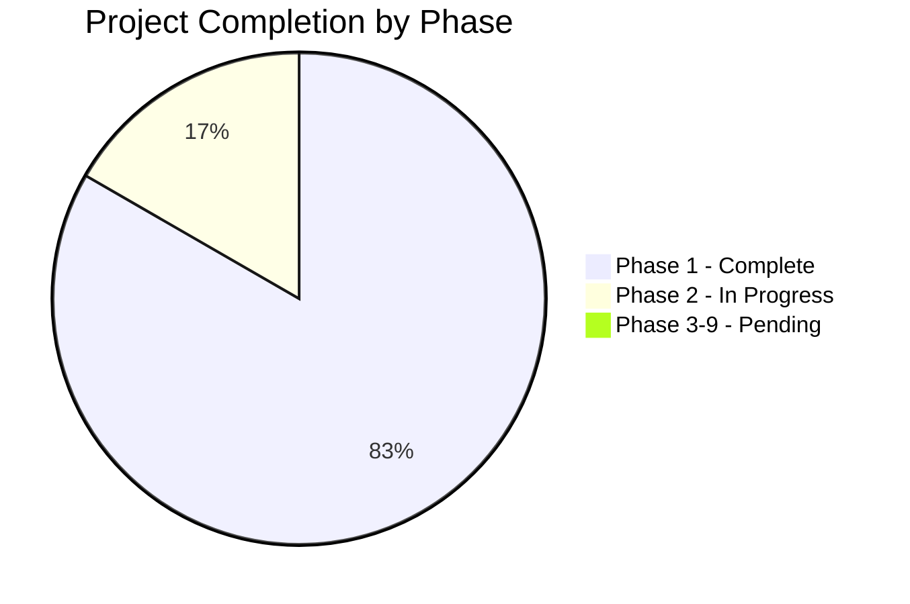

### Test Coverage

| Module | Tests | Coverage | Status |
|--------|-------|----------|--------|
| `utils/timer.py` | 14 | 95% | ✅ |
| `utils/numpy_helpers.py` | 24 | 100% | ✅ |
| `utils/logger.py` | - | - | 🔄 |
| `utils/validators.py` | - | - | 🔄 |

**Total Tests**: 38 passing ✅

### Recent Updates

| Date | Version | Changes |
|------|---------|---------|
| 2025-12-22 | v1.1.0 | NumPy fundamentals notebook, numpy_helpers module |
| 2025-12-22 | v1.0.0 | Initial project structure, Docker setup |

---

## 📈 Learning Tips

### Best Practices

1. **📐 Understand the Math**: Don't skip mathematical intuition
2. **💻 Code from Scratch**: Implement algorithms before using libraries
3. **📊 Visualize Everything**: Use plots to understand behavior
4. **�� Read Comments**: Code is heavily documented
5. **🔁 Practice Daily**: Consistency is key
6. **🧪 Write Tests**: Verify your implementations

### Study Schedule

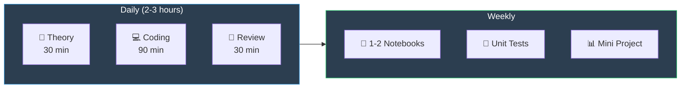

---

## 🔗 Resources

### Documentation

| Resource | Link | Description |
|----------|------|-------------|
| NumPy | [numpy.org](https://numpy.org/doc/) | Array computing |
| Pandas | [pandas.pydata.org](https://pandas.pydata.org/docs/) | Data analysis |
| scikit-learn | [scikit-learn.org](https://scikit-learn.org/stable/) | Machine learning |
| PyTorch | [pytorch.org](https://pytorch.org/docs/) | Deep learning |
| TensorFlow | [tensorflow.org](https://www.tensorflow.org/guide) | Deep learning |

### Learning Platforms

- �� [Kaggle Learn](https://www.kaggle.com/learn) - Free micro-courses
- 📊 [Papers With Code](https://paperswithcode.com/) - Research implementations
- 🎥 [3Blue1Brown](https://www.3blue1brown.com/) - Visual math explanations

---

## 🤝 Contributing

Contributions are welcome! Please:

1. Fork the repository
2. Create a feature branch
3. Write tests for new code
4. Submit a pull request

---

## 📄 License

MIT License - Feel free to use for personal learning.

---

<div align="center">

**Made with ❤️ for Machine Learning Enthusiasts**

⭐ Star this repo if you find it helpful!

</div>
